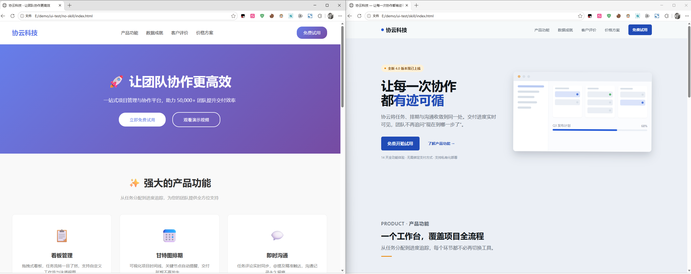
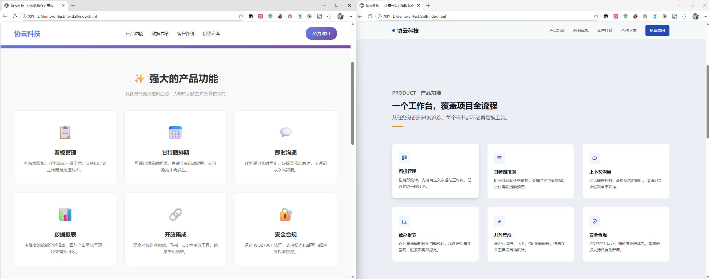
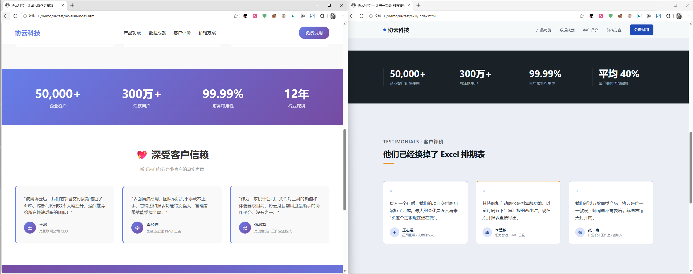
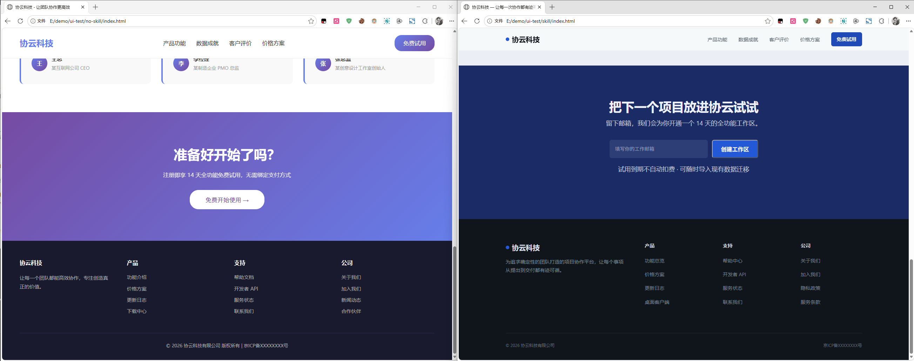

# MiJi — Turn Books, Videos & Podcasts into Agent Skills

> **🌐 Language / 语言：** [中文](README.md) | [English](README_EN.md)

> Why "MiJi"? A triple pun in Chinese: **secret manual** (武林秘籍 — learn the skill the moment you hold it), **game cheat code**, and literally **honey-sweet skill (蜜技)** — brewed by CC for her Poet 🍯
>
> A complete pipeline that turns a book / PDF / video into reusable AI knowledge:
> **Parse (local MinerU OR cloud VLM — pick by your hardware) → Distill methodology → Package as a Skill OR ingest into a Knowledge Base**
> Also supports **video / podcast** (yt-dlp download → faster-whisper transcript → same distillation flow)
>
> v1.3.0 adds: **multi-source fusion** (book + video + article → one combined skill) and a **knowledge-base mode** (skip the skill packaging, keep distilling into topic folders with a built-in AI reading protocol); plus **parallel parsing for big files** (measured 2.1×)
> **Two parsing engines**: local MinerU (~1GB models on YOUR device, runs offline) or cloud VLM transcription (zero hardware bar — luna measured $2.51 for a full book). Pick by your hardware, see "Two Parsing Engines" below

This pipeline was proven end-to-end by **CC**, with three case studies:

1. ***Refactoring UI* (252-page PDF)** → packaged into the `refactoring-ui-principles` skill — validated on **another machine using opencode + GLM 5.3 Flash** with a controlled A/B test (see Demo 1 below)
2. **YouTube Chinese tech tutorial video (8:45)** → processed via video mode (yt-dlp → faster-whisper → LLM correction) into the `minimax-h3-local-deploy` skill (see Demo 2 below)
3. ***Précis de l'Art de la Guerre* (Jomini, 484-page scanned PDF)** → knowledge-base topic `military`; also validated **2.1× parallel parsing** (2026-09-01, see Demo 3 below)

## 📦 Repository Layout

```
MiJi/
├── README.md                                    # Chinese docs
├── README_EN.md                                 # English version (this file)
├── skills/
│   ├── mineru-pdf-parser/SKILL.md               # [Prerequisite 1] MinerU PDF parsing (install/download/pitfalls)
│   └── miji/SKILL.md                            # [Main flow] book/video → Skill pipeline
│       └── scripts/
│           ├── llm_fix.py                       # ASR transcript LLM correction script
│           ├── transcribe_prompt_gen.py         # auto-generate transcription hints from the video title
│           └── merge_sources.py                 # multi-source fusion draft (cross-topic anchors)
├── examples/
│   └── refactoring-ui-principles/               # [Demo 1] PDF-distilled skill
│       ├── SKILL.md                             #    Refactoring UI design-principles cheat sheet
│       └── references/refactoring-ui-full.md    #    Full book archive (58 principles)
│       (Demo 2: the video-distilled minimax-h3-local-deploy skill is published alongside)
├── tools/
│   ├── kb.py                                    # knowledge-base CLI (add/search/draft/export)
│   └── split_pdf.py                             # split a PDF by page ranges (for parallel parsing)
└── docs/images/                                 # A/B comparison screenshots (no-skill vs skill)
```

## 🔄 The Pipeline

```
┌─────────────────────────────────────────────────────────────┐
│  ① Pick ONE parsing engine (by hardware, no ranking):        │
│     A. Local MinerU — ~1GB models, offline, extracts images,  │
│        zero API cost → mineru-pdf-parser skill (route A dep)  │
│     B. Cloud VLM — zero hardware bar, just an API key         │
│        → tools/luna_full_transcribe.py (6 workers, ~$0.5/pg)  │
│  ①b Video/podcast: yt-dlp → ffmpeg audio → faster-whisper    │
├─────────────────────────────────────────────────────────────┤
│  ② Get the full-text Markdown                                │
│     A: mineru -p input.pdf -o out -b pipeline                │
│        (252 pages ≈ 4-6 min; scanned books 3-4× slower)      │
│     B: python3 tools/luna_full_transcribe.py book.pdf out     │
│        (~45s/page × concurrency; full 484-page book: $2.51)   │
├─────────────────────────────────────────────────────────────┤
│  ③ Read the book/transcript (REPL-style, TOC first)         │
├─────────────────────────────────────────────────────────────┤
│  ④ Choose packaging form: cheat-sheet / step-guide / persona │
├─────────────────────────────────────────────────────────────┤
│  ⑤ Choose ONE output (or both):                              │
│     ⚡ skill: SKILL.md (distilled rules) + references/        │
│     📚 KB: kb.py add/draft → TOPIC.md + archives + anchors    │
├─────────────────────────────────────────────────────────────┤
│  ⑥ Verify (skill loads + real run) & deliver                │
└─────────────────────────────────────────────────────────────┘
```

## 📋 Prerequisites (two skills)

| Skill / requirement | Purpose | Dependency |
|-------|---------|------------|
| **`mineru-pdf-parser`** | MinerU setup, model download, Apple Silicon tuning, pitfalls | **Route A (local) only**; skip it on the cloud route |
| **`MiJi`** | The full 6-step book→skill/KB workflow | The main flow itself |
| Route B requirement | any OpenAI-compatible **vision** endpoint + key (self-hosted relay or official) + `pip install pypdfium2` | Route B (cloud) only |

On route A the main-flow skill **loads `mineru-pdf-parser` first** (Step 1) for environment & pitfalls; route B needs no local models at all.

## 🚀 Quick Start

```bash
# ═══ STEP 1: pick ONE parsing engine ═══
#
# 【Route A | local MinerU】 Apple Silicon / GPU, want illustrations, zero API cost:
python3 -m venv mineru-venv && mineru-venv/bin/pip install "mineru[core]"
#   download ~1GB of models (7 sub-paths; China: hf-mirror via proxy or modelscope+aria2)
#   point ~/mineru.json models-dir.pipeline at the model dir, then:
unset PYTHONPATH
export MINERU_PROCESSING_WINDOW_SIZE=32        # prevents MPS crash on long docs
mineru-venv/bin/mineru -p input.pdf -o out -b pipeline
#
# 【Route B | cloud VLM】 zero hardware bar — the primary route for low-spec machines:
pip install pypdfium2                          # the only dependency
export VISION_BASE=http://your-endpoint/v1  VISION_KEY=yourkey  VISION_MODEL=your-vision-model
python3 tools/luna_full_transcribe.py book.pdf out --workers 6     # 6 workers, resumable
cat out/text/p*.md > book_fulltext.md          # merge pages in order
#
# ═══ STEP 2: choose ONE output (or both) ═══
#
# Exit 1 ⚡ skill: drop the two SKILL.md files into your agent's skills dir
#   (Hermes: ~/.hermes/skills/; other agents see notes inside), then say:
#   "package this book into a skill"
#
# Exit 2 📚 knowledge base: ongoing accumulation + full-text search + skill upgrade anytime
python3 tools/kb.py init
python3 tools/kb.py add <topic> book_fulltext.md --type book
python3 tools/kb.py draft <topic>   # then tell your agent: "read the fusion draft, distill TOPIC.md"
```

## ⚠️ Pitfalls Quick Reference (all tested in practice)

| Pitfall | Fix |
|---------|-----|
| `hf download` pulls the full 10GB+ repo | Only 7 sub-paths ≈ 1GB needed; use curl/aria2 on resolve URLs |
| hf-mirror direct = 0 bytes (blocked) | Go through a proxy (6.2MB/s) or modelscope (4.9MB/s) |
| hf CLI: `does not seem to be on huggingface.co` | Don't use hf CLI; curl/aria2 the resolve URL directly |
| MPS crash on batch 3-4 of long docs | `export MINERU_PROCESSING_WINDOW_SIZE=32` |
| PYTHONPATH pollutes the mineru venv | `unset PYTHONPATH` before running |
| Model sha256 verification | HEAD `?download=true` → `x-linked-etag` is the official hash |
| Skill description >60 chars rejected | Trigger-first, one sentence, ≤60 chars |
| 4 parallel MinerU workers → MPS memory accumulation crash | Apple Silicon 32GB limit = 2 workers (2.1×, see "Parallel Parsing") |
| Dragging a PDF into a chat only delivers an icon PNG | That's a placeholder thumbnail — the file itself wasn't uploaded; pass a file path instead |
| Scanned book parsing feels "too slow" | Not stuck: scanned books run OCR and are 3-4× slower than text-layer PDFs (484 pages > 20 min), or go parallel for 2.1× |

## 🧪 Case Demo: Refactoring UI → skill (A/B test)

> The complete demo skill is in `examples/refactoring-ui-principles/` — install & use directly.

### Test Setup

On **another machine (Windows)**, using **opencode + GLM 5.3 Flash**, we ran the **same prompt** (build a single-file static corporate homepage: top nav / hero / 6 feature cards / stats / 3 testimonials / CTA / footer, inline HTML+CSS, no external assets) twice:

- **`no-skill`**: raw prompt only (no skill loaded)
- **`skill`**: loaded the `refactoring-ui-principles` skill produced by this pipeline

### Side-by-Side

**Left = no-skill, right = with skill:**





**Page bottom (CTA + footer):**



**H5:**


### Key Differences

| Dimension | no-skill | with `refactoring-ui-principles` |
|-----------|----------|----------------------------------|
| Headline | "让团队协作更高效" (generic) | "让每一次协作都有迹可循" (memorable) |
| Visual hierarchy | gradient banner + flat cards | brand dot + product mockup + clearer hierarchy |
| CTA section | plain buttons | "免费开始试用 / 了解产品功能" + 14-day trial note |
| Polish | obvious template feel | spacing/contrast/depth follow the book's rules |

**Takeaway**: with the same model and the same prompt, loading a skill distilled from a book measurably improves the output — memorable copy, better visual hierarchy, and real polish. That's the value of this pipeline: **a book's methodology becomes capability that applies automatically on every generation.**

### 🎬 Demo 2: Video Distillation in Action (Chinese tutorial → skill)

**Test video**: a YouTube Chinese tech tutorial (8:45) packed with technical terms (MiniMax H3, ComfyUI, jailbroken model, text encoder…), **no subtitles available** — pure ASR path only, a stress test for transcription quality.

**Pipeline**:

> ⚠️ **Prerequisites to replicate (AI capability checklist)**: ① any OpenAI-compatible LLM API + key (for auto-generating the transcription prompt and post-correction; deepseek/glm/kimi/local ollama all work) ② faster-whisper (`pip install faster-whisper`, runs on CPU) ③ yt-dlp ④ ffmpeg. If subtitles exist, just `--write-subs` and skip ①②.

```
YouTube link
  → yt-dlp audio download (199MB, ~50s)
  → [AI-1] LLM auto-generates initial_prompt from title alone
  → faster-whisper small + that prompt (105s)
  → [AI-2] deepseek-v4-flash LLM post-correction (20s)
  → read all 93 segments → classify as step-guide → package as skill
```

**Three-way benchmark** (same video):

| Approach | MiniMax | 越狱(jailbreak) | ComfyUI | Channel name | Total time |
|----------|:---:|:---:|:---:|:---:|:---:|
| small, no hints | ❌0 | ❌ misheard | ❌0 | ❌ misheard | 2min |
| medium model alone | ⚠️4 | ⚠️2 | ❌ still 0 | ✅3 | ⏱48min |
| **small + hints + LLM fix** 🏆 | ✅9 | ✅9 | ✅3 | ✅4 | **2min20s** |

**Key findings**:
1. `initial_prompt` with domain terms fixes Chinese homophone errors ("粤语模型" → "越狱模型") — and the prompt can be **auto-generated by LLM from the video title alone** (no manual knowledge needed, see `scripts/transcribe_prompt_gen.py`)
2. English brand names like ComfyUI are unfixable at the ASR layer — medium spent 48 minutes and still missed them
3. **LLM correction nails it in one pass**: it has world knowledge about ComfyUI and correctly infers "CONVIO的DESTOB的文件夹" should be "COMFYUI的DESKTOP文件夹" — something no ASR model can do
4. Safety verified: segment count unchanged, character ratio 1.00, timestamps preserved

**Conclusion**: the optimal path for Chinese video distillation is **small fast-transcribe + LLM refine** (2 minutes total), 20× faster than running a bigger model alone while producing higher quality. The correction script is open-sourced at `skills/miji/scripts/llm_fix.py`.

### 📚 Demo 3: 484-page scanned book → knowledge base (2026-09-01)

*Précis de l'Art de la Guerre* (Jomini, 484 pages, **scanned PDF without a text layer**):

```
484-page scanned PDF
  → MinerU local OCR (22.4 min single-process; or split in 2 + 2 workers → 10.7 min, 2.1×)
  → 6,278-line Markdown + 62 original illustrations → kb.py add military (sha1 dedup)
  → auto-generated TOC with three anchor types (headings / chapter markers / numbered rules → line numbers: jump-read 180K tokens without blowing context)
  → CC reads the core chapters → distilled TOPIC.md cheat sheet (decisive-point doctrine / three-choice framework / lines of operations)
```

Two hard limits validated along the way: **2 workers = 2.1× speedup**; **4 workers crash 2/4** (MPS memory accumulation) — the sweet spot on Apple Silicon 32GB is exactly two parallel workers.

### ☁️ Demo 4: dual-engine head-to-head — local OCR vs cloud VLM (cost $2.51)

The same 484-page scanned book, parsed **in full by both engines**, then compared rigorously (2026-09-01):

| Engine | Setup | Time | Result | Cost |
|--------|-------|------|--------|------|
| 🖥 MinerU local (pipeline) | M1 Pro, single process | 22.4 min | 484/484 ✅ | electricity |
| ☁️ GPT-5.6-luna vision transcription | **6 concurrent API calls** | 46 min | **484/484 ✅, zero failures, zero retries** | **$2.51** (≈0.5¢/page) |

**Quality comparison (whole-book, not sampled)**:

| Dimension | Local MinerU | Cloud luna |
|-----------|--------------|------------|
| Character-level agreement | — | **~97%** (10-char sliding window 75.5% → back-computed; remainder is homophone/paraphrase-level drift) |
| Chinese chars | 276,727 | 294,230 (+6.3%: page numbers transcribed 479 lines + fuller footnotes + light polishing) |
| Illustrations | **36 battle diagrams extracted, searchable in the KB** | **0 (all lost)** |
| Footnote markers | 156 | 303 (it even caught in-text footnote marks the layout filter dropped → can backfill the local result) |
| Hallucination/meta-speak | none | only 2 pages say "图中" in reasonable context — **no fabrication observed** |

**Three takeaways**:
1. **Accuracy is a tie, with different strengths**: luna nails harder glyphs (「不与」 where local OCR misread 「不同」) but paraphrases a little — for faithful archival, local is safer
2. **The cloud's real edge is concurrency**: local is capped at 2 workers by MPS (2.1× ceiling); 20 cloud workers could squeeze 46 min into under 10 — for money
3. **Illustrated books belong to local**: luna produces zero images; all 36 battle diagrams came from MinerU

**Reproduce** (scripts in `tools/`, resumable; token limit ≥4000 or it truncates):

```bash
# cloud full transcription (6 concurrent workers)
mineru-venv/bin/python tools/luna_full_transcribe.py book.pdf outdir --workers 6
# dual-engine comparison (char agreement / hallucination scan / page-length distribution)
python3 tools/compare_deep.py
```

### 🔀 Demo 5: hybrid distillation — video + book → one knowledge-base topic (2026-09-01)

Multi-source fusion in full action: **one video + one book** → dual-source distillation under the topic "Unix".

**Inputs**:
- 🎬 AT&T Archives "The UNIX Operating System" (1982, Bell Labs) — YouTube's official transcript taken directly (subs-first: zero ASR, zero download, instant)
- 📖 Eric Raymond, *The Art of UNIX Programming* (Chinese ed.) — 544-page **scanned** PDF, local MinerU OCR, 23 min

**The hybrid payoff: the two sources parallelize naturally** — the video finished instantly while the book was still being OCRed; zero mutual waiting. That's the multi-source dividend in action (heterogeneous bottlenecks: video goes over the network, the book eats the GPU).

**What "hybrid" uniquely produces in TOPIC.md**:

1. **A dual-source complementarity map** — the book is the system, the video is first-hand proof, matched line by line: pipes & composition (book's Composition Rule ↔ Kernighan live-gluing a 5-program spell checker), files as byte streams (book's Textuality chapter ↔ Ritchie "a file is just a sequence of bytes" + printer-redirection demo), tools that build tools (book's Generation Rule ↔ Johnson on the VLSI toolchain)
2. **Video quotes ↔ book principles cross-validated** — Thompson "what matters is what we could leave out" ↔ the Parsimony Rule; Kernighan "I didn't write a single line of code — it's all existing programs glued together" ↔ the Composition Rule. The 1972 masters' own voices become living footnotes to the 2003 book
3. **Decision-scenario jump table** — 12 real scenarios (which data structure? optimize or not? how to cut modules?), each with source-file line numbers, jumping straight into the 220K-token full text via the three-type-anchor TOC

**Reproduce**:

```bash
# video source: subs first (zero ASR when the page ships a transcript)
python3 tools/kb.py add Unix video_transcript.txt --type video --name unix-film-1982
# book source: scanned → MinerU OCR → strip watermarks → ingest (sha1 dedup + auto 3-type-anchor TOC)
python3 tools/kb.py add Unix book_fulltext.md --type book --name taup-book
# dual-source fusion draft (cross-topic anchors auto-analyzed) → agent reads → distills TOPIC.md
python3 tools/kb.py draft Unix
```

Fusion strategy (picked by source relationship): this run was **same-topic complementary** (book = system + video = proof) — book chapters form the skeleton, the video becomes "first-hand evidence" sections; conflicting views are listed side by side with sources. See the fusion-strategy table in skills/miji/SKILL.md.

## 📚 Knowledge-Base Mode (v1.3.0)

MiJi doesn't have to produce one-shot skills — the same parse → distill pipeline can **keep distilling into topic folders**, building a personal knowledge base:

```bash
python3 tools/kb.py init                          # initialize
python3 tools/kb.py add <topic> <files...>        # ingest from any source (PDF / video transcript / article, sha1 dedup)
python3 tools/kb.py draft <topic>                 # multi-source fusion draft (cross-topic anchors)
python3 tools/kb.py search <keyword> [--topic X]  # full-text search (pure Python, CJK-path safe)
python3 tools/kb.py export <topic> --name <slug>  # promote a topic into a skill folder
```

Repository layout (all auto-generated / maintained):

```
knowledge-base/
├── AGENTS.md                # reading protocol for ANY AI (Claude/GPT/Codex/Cursor…)
├── llms.txt                 # llmstxt.org-style site map
├── INDEX.md                 # auto TOC (topic table + cross-topic anchors)
└── topics/<topic>/
    ├── TOPIC.md             # distilled cheat sheet (YAML frontmatter; works in Obsidian/Logseq as-is)
    ├── metadata.json        # machine-readable metadata (source list / sha1 / tokens)
    └── sources/             # full-text archive + images/ illustrations + *.toc.md chapter anchors
```

- **Interops with other AI tools**: plain markdown + YAML frontmatter — opens directly in Obsidian / VSCode / any renderer; agent tools just read `AGENTS.md` to understand the whole protocol
- **Core design philosophy: the longer the stronger — as long as it's quickly locatable**. Distilled artifacts have no length cap: as long as an AI can jump to the target via TOC/keywords/line numbers, locating a needle in 100K tokens costs the same as in 10K, and length turns from a liability into an asset. The library therefore consumes long sources only as "TOC/keyword → line number → `read_file(offset)` jump", reserving whole-file reads for the TOPIC.md cheat-sheet layer (≤7KB)
- **Locatability guarantee: three anchor types in the auto-generated `*.toc.md`** — ① markdown headings ② chapter markers (`第X节` section X / `第X章` chapter X) ③ numbered rules (`NN｜title`, for "71 rules"-style list-form long texts); plus 10 locating keywords auto-injected into the TOC header. Measured: a 10K-char third-party distillation with **zero markdown headings** grew 74 line-number anchors on ingest (random-sampled line numbers all matched verbatim). Pair with `kb.py search` for full-text pinpoint hits
- **skill vs knowledge base**: a skill = frequently-used operating rules; the knowledge base = low-frequency but searchable sediment. Both can coexist for the same topic, and any TOPIC.md can be `export`ed into a skill at any time

## ⚡ Parallel Parsing for Big Files (measured 2.1×)

A few-hundred-page scanned PDF takes 20+ minutes in a single process. Split it and go parallel:

```bash
# 1. split (pure CPU, seconds)
python3 tools/split_pdf.py input.pdf split-dir 2
# 2. launch one MinerU background process per part (each: unset PYTHONPATH + WINDOW_SIZE=32 + its own output dir)
# 3. merge in order: cat p1/*/auto/*.md p2/*/auto/*.md > merged.md (remember to strip PDF watermark lines)
```

| Approach | 484-page scanned book, measured |
|----------|--------------------------------|
| single process | 22.4 min |
| **split ×2, 2 workers** | **10.7 min (2.1×)** |
| split ×4, 4 workers | ❌ 2/4 crashed (MPS memory accumulation) |

- Quality is equivalent: merged output matches the serial run in line count, the split seam is seamless, only ~2% line-level OCR jitter
- **On Apple Silicon 32GB the safe ceiling is exactly 2 workers** (3 untested — don't push it)
- For scanned tomes only; text-layer PDFs already parse fast (252 pages in 4-6 min) and aren't worth splitting
- A crashed part can simply be re-run (independent output dirs, idempotent)

## 🔀 Two Parsing Engines — Pick by YOUR Hardware (both first-class, no ranking)

The PDF-parsing step offers **two complete routes**, each usable on its own — there is no "primary vs fallback" hierarchy. Choose by your hardware and needs:

| | 🖥 MinerU local | ☁️ luna cloud VLM |
|---|---|---|
| Hardware | ~1GB local models (Apple Silicon / GPU preferred) | **Zero hardware bar** — just an API key |
| Best for | M-series Mac / discrete GPU users, illustration extraction, zero API cost | Low-spec machines / no GPU / no local environment |
| Speed | 4-6 min per 252 text pages; scanned 3-4× slower (parallel 2.1×) | ~45s/page × concurrency (full 484-page book measured $2.51) |
| Output | md + **extracted images** + coordinates | text-only md (no images; run local later to extract) |
| Data flow | all on-device, runs offline | page images go through the API over HTTPS |

**Rule of thumb**: low-spec / no-GPU machine → **luna IS your primary route** (for many users it's the only viable one); have Apple Silicon/GPU → MinerU is cheaper and yields illustrations; mixing also works (local primary + cloud for hard pages).

Where each stage's data lives (transparently listed, no restrictions — user decides):

| Stage | Where it runs | Notes |
|-------|---------------|-------|
| PDF layout & OCR (MinerU route) | Your device | pipeline mode: PP-DocLayoutV2 / PaddleOCR / unimernet / table models, ~1GB local weights, **runs offline** |
| Full-page transcription (luna route) | Cloud API | pages rendered to images, called via HTTPS; use your own relay or any compatible endpoint |
| Video transcription | Your device | faster-whisper locally (CPU is fine) |
| LLM correction / prompt gen | local or cloud, both fine | ollama can replace it locally, or skip entirely |
| Distillation itself | Your agent | needs no external service |

Two notes:
- MinerU's `hybrid` / VLM engine invokes a vision-language model (more VRAM / network) — use `-b pipeline` for a purely offline run
- faster-whisper downloads its model from HuggingFace on first run (a few hundred MB, one-time), fully offline afterwards

## 🙏 Dependencies & Acknowledgements

This pipeline stands on these great open-source projects — thank you to their authors:

| Dependency | GitHub | Used for |
|------------|--------|----------|
| **MinerU** | https://github.com/opendatalab/MinerU | PDF parsing engine (OCR/layout/formula/table) — the core |
| **PDF-Extract-Kit-1.0** | https://github.com/opendatalab/PDF-Extract-Kit | MinerU's model repo (7 sub-models: Layout/MFR/OCR/TabRec…) |
| **book-to-skill** | https://github.com/virgiliojr94/book-to-skill | Inspiration for book→skill (Copilot/Amp/Claude Code ecosystem; this repo is the Hermes-flavored cheat-sheet variant) |
| **aria2** | https://github.com/aria2/aria2 | Multi-threaded model download (810MB from modelscope in ~20s) |
| **ModelScope** | https://github.com/modelscope/modelscope | High-speed model source inside China |
| **pypdfium2** | https://github.com/pypdfium2-team/pypdfium2 | PDF page splitting (prerequisite for parallel parsing) |
| **Refactoring UI** | https://refactoringui.com | Validation case (Adam Wathan & Steve Schoger) |

Special thanks:
- **OpenDataLab team** (MinerU / PDF-Extract-Kit) — making high-quality document parsing available to everyone
- **virgiliojr94** (book-to-skill) — the original idea of turning books into skills
- **Adam Wathan & Steve Schoger** — the first book this pipeline was tested on

## 📄 License

MIT
